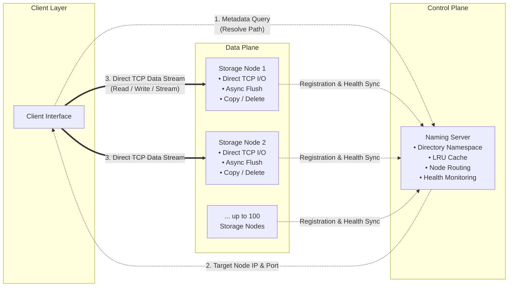

# Fault-Tolerant Distributed Storage System

> A concurrent distributed file system in C (GNU C99/C11) with decoupled metadata and data planes. Features a centralized Naming Server with LRU caching, direct client-to-storage TCP streaming, and asynchronous disk flushing.

[](https://gcc.gnu.org/)
[](https://kernel.org/)
[]()
[]()
[]()
[]()

---

## Table of Contents

- [Overview](#overview)
- [System Architecture](#system-architecture)
- [Engineering Highlights](#engineering-highlights)
- [Technical Specifications](#technical-specifications)
- [Build & Deploy](#build--deploy)
- [Project Structure](#project-structure)
- [Contact](#contact)

---

## Overview

This system decouples **metadata management** from **physical data storage** to avoid single-point bottlenecks during heavy I/O operations. A centralized **Naming Server (NS)** maintains the global directory tree and routes clients to the appropriate **Storage Server (SS)**, while all data transfers occur directly over TCP between clients and storage nodes.

**Core capabilities:**
- Concurrent read/write operations across distributed storage nodes via POSIX threads
- Thread-safe LRU cache for O(1) repeated path lookups
- Synchronous and asynchronous disk flush strategies (15-second buffered intervals)
- Real-time audio streaming via direct TCP byte-streaming with `libmpv`
- Automatic storage server re-registration and directory tree re-sync on reconnect
- Strict path isolation enforced by the Naming Server

---

## System Architecture



| Component | Role | Core Responsibilities |
|---|---|---|
| **Naming Server (NS)** | Orchestration | Global directory tree management, LRU caching, client-to-SS routing, SS health monitoring |
| **Storage Server (SS)** | Physical Storage | Direct client data transfers, asynchronous disk flushing, execution of internal NS commands (Copy/Delete) |
| **Client** | Interface | Metadata querying via NS and high-throughput TCP streaming directly with the assigned SS |

---

## Engineering Highlights

**High-Concurrency Engine**  
Engineered using POSIX threads (`pthreads`) and strict mutex synchronization to handle concurrent read/write operations from multiple clients across distributed nodes without data races or deadlocks.

**Thread-Safe LRU Cache**  
The Naming Server implements a custom Least Recently Used cache to store frequent directory path lookups, reducing directory traversal from O(n) to O(1) for repeated requests.

**Custom TCP/IP Network Protocol**  
Reliable data transmission over TCP sockets using strict packet-formatting and chunking. Handles massive file transfers and real-time audio streaming, adjusting to network latency.

**Synchronous & Asynchronous I/O**  
Supports immediate blocking disk writes (synchronous) and buffered writes that flush to persistent memory at 15-second intervals (asynchronous) to optimize hardware I/O loads.

**Fault Recovery**  
Reconnecting Storage Servers seamlessly sync their previously assigned index with the Naming Server's global directory tree to resume operations.

**Path Isolation**  
Storage Servers self-report their accessible directory paths upon initialization. The Naming Server enforces strict path isolation; clients cannot manipulate data outside explicitly shared scopes.

---

## Technical Specifications

| Parameter | Specification |
|---|---|
| Max Storage Servers | 100 concurrent SS nodes |
| Client Load per SS | 10 simultaneous I/O streams (configurable via `SERVER_LOAD` macro) |
| Cache Lookup (Hit) | O(1) |
| Cache Lookup (Miss) | O(n) directory traversal |
| Async Flush Interval | 15 seconds |

---

## Build & Deploy

### Prerequisites

- GCC compiler & GNU `make`
- `libmpv-dev` (for audio streaming support)

```bash
sudo apt-get update && sudo apt-get install libmpv-dev
```

### Compilation

```bash
git clone https://github.com/Ekansh0301/Fault-Tolerant-Distributed-Storage-System.git
cd Fault-Tolerant-Distributed-Storage-System
make
```

### Execution Sequence

Components must be initialized in the following order:

**1. Initialize Naming Server**
```bash
./ns.out
```

**2. Initialize Storage Server(s)** *(new terminal)*
```bash
./ss.out <NAMING_SERVER_IP>
```
Follow the CLI prompts to register accessible local paths. The NS assigns a network index.

**3. Connect Client** *(new terminal)*
```bash
./client.out <NAMING_SERVER_IP>
```
Execute `READ`, `WRITE`, `STREAM`, `CREATE`, `DELETE`, or `COPY` via the interactive interface.

---

## Project Structure

```text
.
├── common/                  # Shared core utilities and network protocol logic
├── naming_server/           # Centralized metadata, caching, and SS routing
├── storage_server/          # Distributed physical storage nodes and I/O handling
├── client/                  # Client-side interface and direct SS communication
├── test_audio/              # Validation media for real-time streaming
└── Makefile                 # Build automation
```

